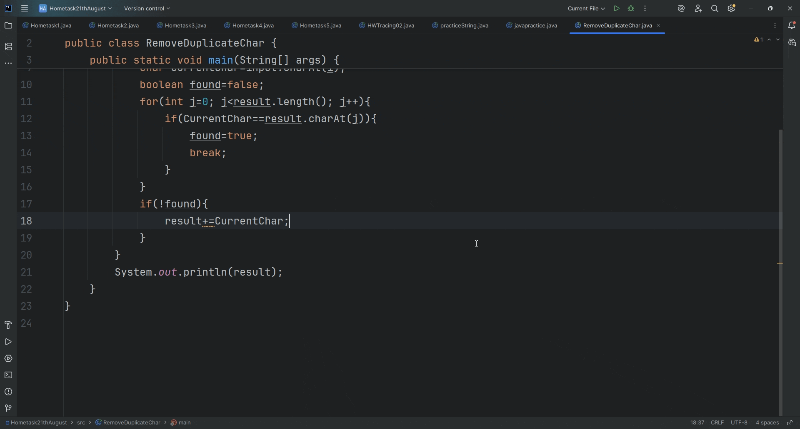

# RemoveDuplicateChar

A simple Java program that removes duplicate characters from a given string input by the user.

## How it Works

- The program takes a string input from the user.
- It iterates through each character of the input.
- It checks if the character has already been added to the result string.
- If not, it adds the character; otherwise, it skips it.
- The final result is a string with all duplicate characters removed.

## 🎥 Demo Output

### How to Run

1. Clone the repository:

2. Navigate to the directory:

3. Compile the program:

